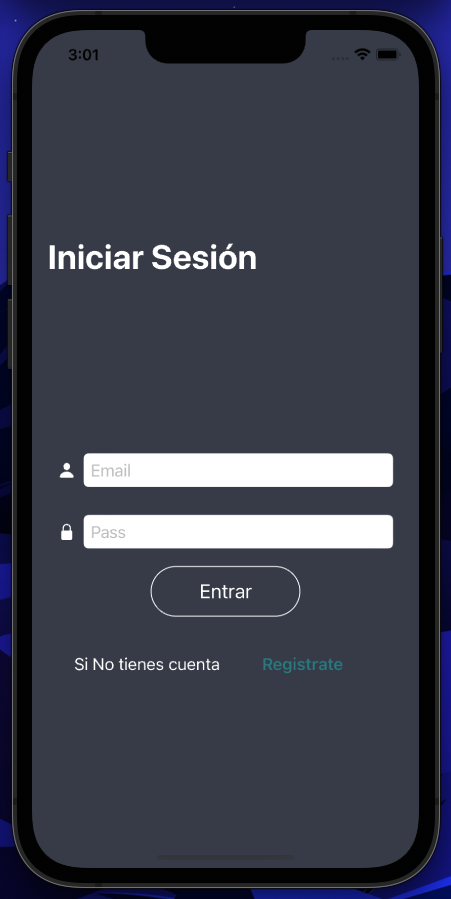

# AppGalery

Application to store your games from different companies such as Xbox, PlayStation or Nintendo, the main objective with this application is to learn how to use firebase dependencies using cocoapods as a manager, to use the authentication and information storage services and images

## Tech Stack

**Client:** Swift, SwiftUI

**Server:** Firebase

## Demo

 

## Authors

- [@Donaldo](https://github.com/DonaldoGalloso)
